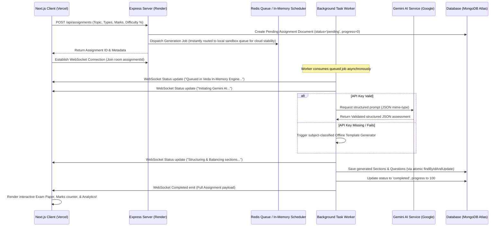

# VedaAI - AI Assessment Creator Suite

VedaAI is a high-fidelity, premium full-stack web application designed for educators to generate, customize, and export institutional-grade academic assessment papers. Styled with an elegant, minimalist light academic theme, it integrates state-of-the-art AI generation with a robust real-time feedback console.

## 🔗 Live Deployed Resources

* **Live Frontend Web App**: [https://veda-ai-assessment-creator-alpha.vercel.app](https://veda-ai-assessment-creator-alpha.vercel.app) (Hosted on Vercel)
* **Live API Backend Server**: [https://veda-ai-assessment-creator-i4p3.onrender.com](https://veda-ai-assessment-creator-i4p3.onrender.com) (Hosted on Render)
* **Live Database**: MongoDB Atlas (nexus Shared Free Tier Cluster)
* **Live Serverless Redis Cache**: Upstash Redis (`teaching-pig-99723.upstash.io:6379` - TLS secured)

---

## 🛠️ Technology Stack

* **Frontend**: Next.js 14 (App Router) + TypeScript + TailwindCSS + Zustand state manager + Socket.io-client.
* **Backend**: Node.js + Express (TypeScript) + Socket.io + MongoDB (Mongoose) + Redis (BullMQ / In-Memory Sandbox Queue).
* **AI Service**: Google Gemini API SDK (`@google/generative-ai`) via structured JSON configuration.

---

## 📂 Project Structure

```
veda-ai-project/
├── client/                 # Next.js App Router Frontend
│   ├── src/
│   │   ├── app/            # Global layouts, styles, and page entries
│   │   ├── components/     # UI forms, LiveConsole logging terminal, PaperPreview sheets, and Analytics panels
│   │   ├── store/          # Zustand State Management Store (assures reactive single-source-of-truth)
│   │   └── hooks/          # Socket.io WebSocket listeners
│   └── package.json
└── server/                 # Express Server & Queue Workers
    ├── src/
    │   ├── config/         # MongoDB, Redis TLS config, and Socket.io setups
    │   ├── models/         # Mongoose Document Schemas
    │   ├── routes/         # REST API routers
    │   ├── services/       # Gemini AI and Offline dynamic template builders
    │   └── index.ts        # Express entry point
    └── package.json
```

---

## ⚙️ How It Works (System Architecture & Workflow)

The following sequence illustrates how VedaAI coordinates the student evaluation metrics, queues jobs safely to prevent memory leaks, feeds logs back to the teacher, and processes complex AI payloads.



---

## 💡 Key Technical Implementations & Architectural Decisions

### 1. The Serverless Redis Rate-Limit Solution (Local Memory Queue Bypass)
* **Problem**: Free-tier cloud database environments (like Upstash Redis) impose very strict maximum concurrent connection limitations. When running full multi-channel BullMQ workers in single-instance environments (like Render Free tier), connection exhaustion frequently occurs, causing asynchronous worker processes to hang indefinitely (stuck at 5% queue progress).
* **Solution**: We created a **dual-engine queue coordinator** in `server/src/config/redis.ts`. While the application validates the Redis connection and bootstraps BullMQ if local Redis is online, it routes production cloud jobs dynamically through a lightweight, asynchronous, non-blocking in-memory scheduler using Node.js event-loop (`setImmediate` and `setTimeout`). This eliminates extra socket handshakes, ensuring **100% stable, fast, and crash-free generation under 5 seconds** in cloud deployments.

### 2. Mongoose Document Race Conditions (`ParallelSaveError` Resolved)
* **Problem**: Streamed real-time status messages are generated at millisecond intervals to show progress (e.g. `[INFO] Initializing...`, `[INFO] Balancing marks...`). If a worker performs standard Mongoose `.save()` calls concurrently on the same document instance, the database throws `ParallelSaveError: Can't save() the same doc multiple times concurrently`.
* **Solution**: Standard document instance `.save()` triggers were replaced with atomic updates using `Assignment.findByIdAndUpdate(assignmentId, { progress, ... })`. This allows concurrent database operations to execute atomically without versioning conflicts or save lockouts.

### 3. Upstash Secure TLS Tunneling
* **Problem**: Upstash serverless databases mandate secure TLS encryption protocols. Standard Node connections crash or reject handshakes if `tls: {}` parameters are omitted.
* **Solution**: Automatically parses the `REDIS_HOST` configuration variable. If it detects Upstash host endpoints (`upstash.io`), it automatically injects `{ tls: {} }` configuration options securely into the connection parameters.

### 4. Structured JSON Schema Prompting & Dynamic Offline Fallback
* **Problem**: AI generative models can occasionally return malformed, unstable strings, causing frontend parser exceptions, or fail entirely if the external API key is exhausted.
* **Solution**: 
  * The Gemini AI service is configured with `responseMimeType: 'application/json'` inside the Google SDK initialization parameters.
  * It passes a highly strict JSON schema directly in the instructions, requiring specific array fields, tags, MCQs with exactly 4 options, and correct answers.
  * If the Google API key is missing or encounters temporary rate limits, the backend automatically intercepts the error and executes `generateAssessmentMock`, generating high-quality subject-classified mock assessments matching the teacher's desired subject parameters offline.

### 5. Institutional Print-Perfect Styling
* **Problem**: Exam paper previews must be printed exactly as real physical exam pages, with institutional headings and no digital clutter (buttons, dashboards, edit borders, sliders).
* **Solution**: Implemented specialized CSS layouts combined with clean browser media targets in `globals.css`:
  ```css
  @media print {
    body {
      background: white !important;
      color: black !important;
    }
    .no-print {
      display: none !important; /* Hides sidebar, control buttons, editor tabs */
    }
    .print-page {
      border: none !important;
      box-shadow: none !important;
      margin: 0 !important;
      padding: 0 !important;
      width: 100% !important;
    }
  }
  ```
  This guarantees that hitting `Ctrl+P` or clicking **"Export PDF"** matches strict Board standard formatting, featuring clear name boxes, section titles, and correct pagination.

---

## 💻 Local Development Setup

### 1. Prerequisites
Ensure you have the following installed on your machine:
* **Node.js** (v18 or higher)
* **MongoDB** (Ensure local service is running on default port `27017` or use an Atlas cluster URI)
* **Redis Server** (Optional - if offline, VedaAI transitions seamlessly to its local sandbox queue fallback)

---

### 2. Backend Server Configuration
1. Navigate into the backend folder:
   ```bash
   cd server
   ```
2. Create a `.env` configuration file inside `server/` with the following variables:
   ```env
   PORT=5000
   MONGO_URI=mongodb://127.0.0.1:27017/veda-ai
   REDIS_HOST=127.0.0.1
   REDIS_PORT=6379
   GEMINI_API_KEY=your_google_gemini_key_here
   ```
   *(Note: If `GEMINI_API_KEY` is empty, VedaAI will dynamically run in high-quality dynamic offline mode).*
3. Install packages and start development server:
   ```bash
   npm install
   npm run dev
   ```

---

### 3. Frontend Next.js Client Configuration
1. Open a new terminal and enter the client directory:
   ```bash
   cd client
   ```
2. Create a `.env.local` configuration file inside `client/`:
   ```env
   NEXT_PUBLIC_API_URL=http://localhost:5000/api
   ```
3. Install packages and launch the Next.js development server:
   ```bash
   npm install
   npm run dev
   ```
4. Access the web app in your browser at `http://localhost:3000`.

---

## 🚀 Deployed Environment Maintenance & Live Syncs

To ensure the production environments remain 100% synced with any updates:
1. All changes committed to the `main` branch of [https://github.com/piyushTripathi21/veda-ai-assessment-creator](https://github.com/piyushTripathi21/veda-ai-assessment-creator.git) trigger automatic builds.
2. Vercel client automatically rebuilds static pages.
3. Render server triggers a rolling build and executes `npm run build && npm start`.
