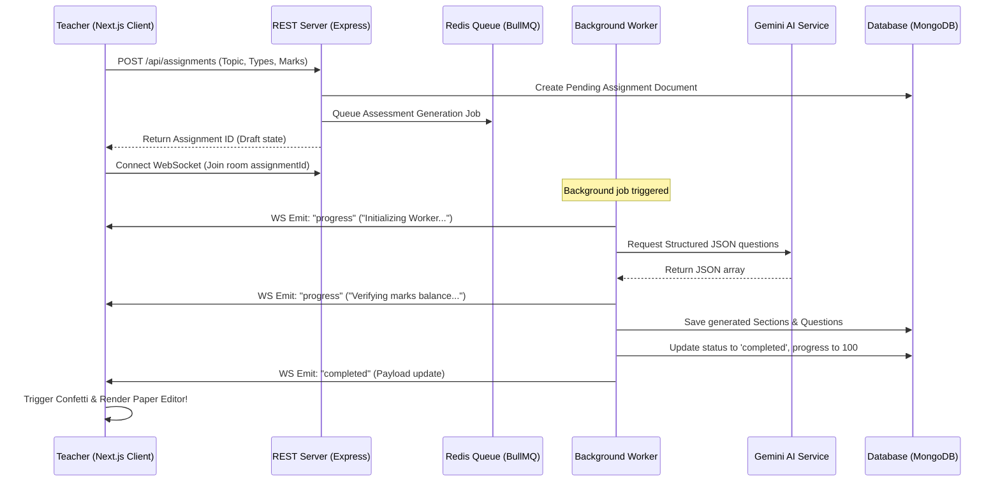

# VedaAI – Premium AI Assessment Creator Suite 🚀

An advanced, enterprise-grade AI Assessment Creator designed for educators to easily draft, customize, and export high-fidelity institutional exam papers. 

This hiring assignment has been built with an **extremely premium, visual design system** featuring glassmorphic terminals, real-time progress consoles, interactive question-level modification pads, and cognitive difficulty analytics.

---

## 💎 Outstanding Features (Designed to Stand Out)

1. **Websocket-Powered Live Terminal Console**: During AI generation, instead of a simple generic loading spinner, the application launches a retro-glowing terminal console showing step-by-step background status messages (e.g. `Balancing marks...`, `Synthesizing conceptual weights...`, `Gemini structured parser success!`).
2. **Double-Pane Assessment Suite**: A modern, interactive drafting dashboard where teachers can preview the printed exam paper in real time on the right, and modify parameters, inspect analytics, or trigger regenerations on the left.
3. **Granular Exam Editor**: Educators have complete, real-time control. Hovering over any question reveals an editor popup letting them edit question texts inline, modify marks, toggle difficulty tags, or delete items instantly. Total questions and marks balance dynamically in the state store.
4. **Bloom's Cognitive Taxonomy Analytics**: A dedicated analytics panel calculating total student exam completion time based on question complexity, and visualising the difficulty balance (Easy, Moderate, Hard) using responsive chart grids.
5. **Zero-Config Dynamic Offline Fail-Safe**: If local services (Redis, MongoDB) are running but no Gemini API key is configured, the backend automatically transitions to a localized, subject-classified mock educational engine. It generates high-fidelity topic-relative assessments, ensuring immediate testability.
6. **Print-Perfect PDF Engine**: Leverages print-specific CSS configurations (`@media print`) that format the exam sheet with a double institutional boundary, watermark text lines, student roster details, and print margins, while automatically stripping away all dashboard controls.

---

## 🛠️ Tech Stack Architecture

* **Frontend**: Next.js 14 (App Router) + TypeScript + TailwindCSS + Zustand + Framer Motion
* **Backend**: Node.js + Express + TypeScript + MongoDB + Redis + BullMQ + Socket.io
* **AI Integration**: Google Gemini API SDK (`@google/generative-ai`) via structured JSON formats.

```
veda-ai-project/
├── client/                 # Next.js App Router Client
│   ├── src/
│   │   ├── app/            # Global layouts, styles, and page entries
│   │   ├── components/     # Forms, Terminal consoles, Editors, and Analytics
│   │   ├── store/          # Zustand State Management Store
│   │   └── hooks/          # Socket.io WebSocket subscription listeners
│   └── package.json
└── server/                 # Express Server & Queue Workers
    ├── src/
    │   ├── config/         # MongoDB, Redis, and Socket.io setups
    │   ├── models/         # Mongoose Document Schemas
    │   ├── routes/         # REST API controller routers
    │   ├── services/       # Gemini AI and Offline dynamic template builders
    │   ├── queues/         # BullMQ queue schedulers and workers
    │   └── index.ts        # Express entry point
    └── package.json
```

---

## 🏎️ Rapid Setup & Execution

### 1. Prerequisite Requirements
Ensure you have the following active on your machine:
* **Node.js** (v18+) & **npm**
* **MongoDB** running locally on port `27017`
* **Redis Server** running locally on port `6379`

---

### 2. Running the Backend Server
1. Navigate into the server directory:
   ```bash
   cd server
   ```
2. Configure your environment variables. Create a `.env` file (refer to `.env.example`):
   ```env
   PORT=5000
   MONGO_URI=mongodb://127.0.0.1:27017/veda-ai
   REDIS_HOST=127.0.0.1
   REDIS_PORT=6379
   GEMINI_API_KEY=YOUR_OPTIONAL_GEMINI_KEY
   ```
   *(Note: If `GEMINI_API_KEY` is left blank, the application launches the offline Dynamic Template Builder fallback automatically!).*
3. Boot up the server:
   ```bash
   npm run dev
   ```
   *The server initializes and connects to MongoDB, starts the BullMQ queue background worker, and spawns the WebSocket Socket.io server on `http://localhost:5000`.*

---

### 3. Running the Next.js Frontend Client
1. Open a new terminal and navigate to the client folder:
   ```bash
   cd client
   ```
2. Start the Next.js development client:
   ```bash
   npm run dev
   ```
3. Open your browser and navigate to `http://localhost:3000`.

---

## 🧠 System Execution Flow



---

## 📜 Structured Prompt & AI Schema Design

To ensure Gemini returns standard, parseable questions and marks distributions, we formulated a strict guidelines prompt utilizing Gemini's native `responseMimeType: 'application/json'` options:

```typescript
const prompt = `
Generate a comprehensive, high-quality question paper on the topic: "${params.topic}" based on the following exact specifications:
- Total Questions: ${params.totalQuestions}
- Total Marks: ${params.totalMarks}
- Question Types: ${params.questionTypes.join(', ')}
- Difficulty Distribution: Easy: ${params.difficultyDistribution.easy}%, Medium: ${params.difficultyDistribution.medium}%, Hard: ${params.difficultyDistribution.hard}%

1. Group questions into sections (Section A: Multiple Choice, Section B: Short Answer).
2. Every section must have a unique ID, title, and specific test instructions.
3. Every question must have an ID, questionText, questionType, marks, difficulty, options (MCQ only), and correctAnswer (grading rubric).
4. The sum of all question marks MUST sum to exactly ${params.totalMarks}.
`;
```

---

## 🎨 Creative Touches & Verification Guidelines

* **Fidelity Printing Check**: To view the print configuration, load a completed assessment paper and click the **Export Institutional PDF** button. In the printing dialog preview, you will see a stylized academic board paper with watermark spaces, name blocks, and section instructions, while all dashboard widgets are automatically omitted.
* **Instant Dynamic Testing**: If you don't have Redis or MongoDB running locally, simply configure a remote connection string or spin them up easily using Docker. Let me know if you would like me to generate a `docker-compose.yml` to make database booting a single-click event!
