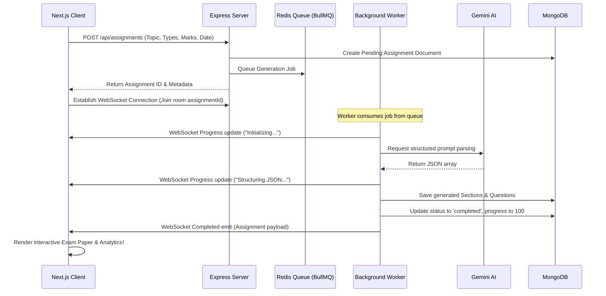

# VedaAI - AI Assessment Creator Suite

VedaAI is a full-stack web application designed for educators to generate, customize, and export institutional-grade academic assessment papers. The system uses a Next.js frontend and a Node.js/Express backend, integrated with Google Gemini AI for structured content generation and real-time updates powered by WebSockets.

---

## 🛠️ Technology Stack

* **Frontend**: Next.js 14 (App Router) + TypeScript + TailwindCSS + Zustand + Socket.io-client
* **Backend**: Node.js + Express (TypeScript) + Socket.io + MongoDB (Mongoose) + Redis (BullMQ / In-Memory Queue Fallback)
* **AI Service**: Google Gemini API SDK (`@google/generative-ai`) via structured JSON configuration

---

## 📂 Project Structure

```
veda-ai-project/
├── client/                 # Next.js App Router Client
│   ├── src/
│   │   ├── app/            # Global layouts, styles, and page entries
│   │   ├── components/     # UI forms, Live logging consoles, Previews, and Charts
│   │   ├── store/          # Zustand State Management Store
│   │   └── hooks/          # Socket.io WebSocket subscription listeners
│   └── package.json
└── server/                 # Express Server & Queue Workers
    ├── src/
    │   ├── config/         # MongoDB, Redis, and Socket.io setups
    │   ├── models/         # Mongoose Document Schemas
    │   ├── routes/         # REST API routers
    │   ├── services/       # Gemini AI and Offline dynamic template builders
    │   ├── queues/         # BullMQ queue workers and local fail-safes
    │   └── index.ts        # Express entry point
    └── package.json
```

---

## 🚀 Local Development Setup

### 1. Prerequisites
Ensure you have the following installed locally:
* **Node.js** (v18+)
* **MongoDB** (Running on default port `27017`)
* **Redis Server** (Optional, default port `6379`)
  * *Note: If Redis is offline, the backend automatically transitions to a local in-memory event-loop queue to allow seamless execution without any setup required.*

---

### 2. Running the Backend Server
1. Navigate into the server directory:
   ```bash
   cd server
   ```
2. Create a `.env` configuration file inside the `server/` directory:
   ```env
   PORT=5000
   MONGO_URI=mongodb://127.0.0.1:27017/veda-ai
   REDIS_HOST=127.0.0.1
   REDIS_PORT=6379
   GEMINI_API_KEY=your_gemini_api_key_here
   ```
   *Note: If `GEMINI_API_KEY` is omitted, the backend server will automatically switch to local dynamic dynamic templates for mock execution.*
3. Install dependencies and start the server:
   ```bash
   npm install
   npm run dev
   ```
   *The server will boot, establish MongoDB connections, initialize WebSockets, and listen on `http://localhost:5000`.*

---

### 3. Running the Next.js Client
1. Open a new terminal and navigate to the client folder:
   ```bash
   cd client
   ```
2. Install dependencies and start the development server:
   ```bash
   npm install
   npm run dev
   ```
3. Open your browser and navigate to `http://localhost:3000`.

---

## ⚙️ How It Works (System Workflow)



1. **Assignment Creation**: The teacher defines parameters including topic, due date, question styles (MCQ, Short, Long, True/False), total questions, total marks, and difficulty distribution (sliders dynamically scale to sum to 100%).
2. **Queued Generation**: The API creates a database record and queues a job. If Redis is online, BullMQ coordinates the background task. If Redis is offline, a local setTimeout scheduler coordinates the task to prevent application crashes.
3. **Real-time Live Console Logs**: While the background task runs, the worker streams granular status events (`[INFO] API key detected...`, `[INFO] Balancing marks...`) via Socket.io. The frontend captures these events and prints them in a styled logging terminal with a percentage loading bar.
4. **Fidelity Paper Review & Editing**: Once complete, the exam is rendered as a clean, institutional double-bordered paper. Hovering over questions opens inline controls letting the teacher edit text, alter marks, change difficulty tags, or delete items. The total marks and question counters automatically recalculate in the state.
5. **Print-Perfect PDF Rendering**: Clicking "Export Institutional PDF" triggers the system print dialogue. Standard CSS rules (`@media print`) hide control panels, navigation bars, and buttons, formatting the central document as a physical A4 paper page with custom margins, double-lines, name inputs, and grading keys.

---

## 📝 Structured Prompt & AI Schema Design

To guarantee consistent structured parsing, the backend specifies `responseMimeType: 'application/json'` inside the Gemini SDK parameters, passing the following prompt guidelines:

```typescript
const prompt = `
Generate a comprehensive, high-quality question paper on the topic: "${params.topic}" based on the following specifications:
- Total Questions: ${params.totalQuestions}
- Total Marks: ${params.totalMarks}
- Question Types: ${params.questionTypes.join(', ')}
- Difficulty Distribution: Easy: ${params.difficultyDistribution.easy}%, Medium: ${params.difficultyDistribution.medium}%, Hard: ${params.difficultyDistribution.hard}%

JSON Schema to return:
[
  {
    "id": "string",
    "title": "string",
    "instructions": "string",
    "questions": [
      {
        "id": "string",
        "questionText": "string",
        "questionType": "MCQ" | "Short" | "Long" | "TrueFalse",
        "options": ["string", "string", "string", "string"], // Only for MCQ
        "correctAnswer": "string",
        "marks": number,
        "difficulty": "easy" | "medium" | "hard"
      }
    ]
  }
]
`;
```
